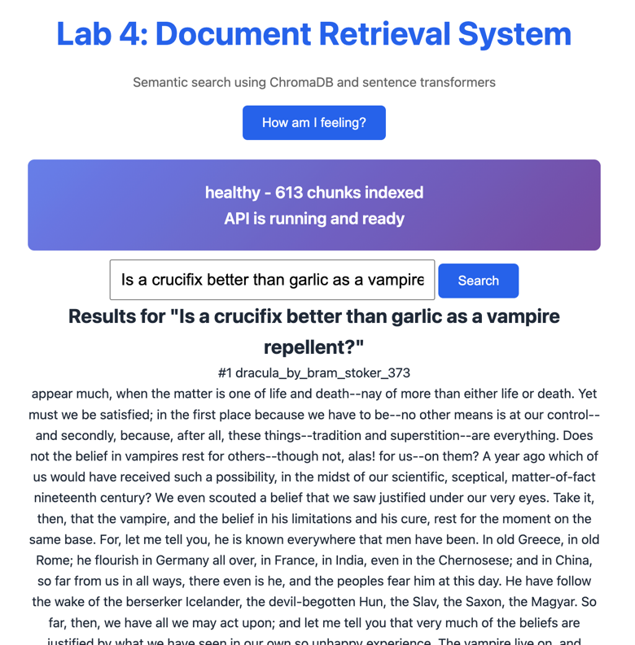

# P2: Document Retrieval System

Semantic search system using ChromaDB and sentence transformers<br>for [ARIN 5360 at Seattle University](https://catalog.seattleu.edu/preview_course_nopop.php?catoid=55&coid=190380)
Includes chunking and support for PDF files.

## Feature Progression

| Feature | Lab 3 | Lab 4 | P2 |
|---------|-------|-------|-----|
| **Text file support** | ✅ | ✅ | ✅ |
| **PDF support** | ❌ | ✅ | ✅ |
| **Document chunking** | ❌ | ✅ | ✅ |
| **Semantic search** | ✅ | ✅ | ✅ |
| **Cross-encoder reranking** | ❌ | ❌ | ✅ |
| **Keyword search (BM25)** | ❌ | ❌ | ✅* |
| **Hybrid search (RRF)** | ❌ | ❌ | ✅* |

*\*Extra credit in P2*

### New Features in P2 _(Extra Credit)_

- **BM25 Keyword Search**: Traditional keyword matching using BM25 algorithm
- **Reciprocal Rank Fusion**: Combines semantic and keyword results
- **Benefit**: Captures both semantic similarity and exact keyword matches

### New Features in P2 _(Required)_
 
- **Implementation**: Uses a cross-encoder model to rerank initial search results
- **Benefit**: Improves relevance by considering query-document interaction
- **Model**: `cross-encoder/ms-marco-MiniLM-L-6-v2`

### New Features in Lab 4

- **PDF Support**: Load and index PDF documents alongside text files
- **Document Chunking**: Automatically split large documents into overlapping chunks for better retrieval
- **Improved Metadata**: Track document type, chunk information, and source files

### Features in Lab 3

- **Semantic Search**: Use sentence transformers to encode documents and perform semantic search


## Setup

```bash
# Install dependencies
uv sync
```
### Checking Out Assignment Code

Each assignment corresponds to a version tag:

| Assignment | Version | Git Tag               |
|------------|------------|-----------------------|
| Lab 3 | 1.0.0      | lab3_final _(sic)_    |
| Lab 4 | 2.0.0      | lab4-final            |
| Project 2 (required) | 3.0.0      | p2-required-final     |                 
| Project 2 (extra credit) | 3.1.0      | p2-extra-credit-final |

Use `git checkout <tag>` to access that assignment's code.

## Running the Server

```bash
uv run uvicorn src.retrieval.main:app --reload
```

Server starts at http://localhost:8000

## Usage

**Web Interface:** Visit http://localhost:8000

**API:**
```bash
# Health check
curl http://localhost:8000/health

# Search
curl -X POST http://localhost:8000/search \
  -H "Content-Type: application/json" \
  -d '{"query": "machine learning", "n_results": 5}'
```

### Compare Approaches
```python
# Baseline: Semantic only
baseline = DocumentRetriever(use_reranking=False, use_hybrid=False)

# Required: With reranking (default)
with_rerank = DocumentRetriever(use_hybrid=False)

# Extra Credit: Full system by default
full_system = DocumentRetriever()

# Compare results for same query
query = "machine learning algorithms"
results_baseline = baseline.search(query)
results_rerank = with_rerank.search(query)
results_full = full_system.search(query)
```

## Testing

```bash
# Run all tests with coverage
uv run pytest

# Run with coverage report
uv run pytest --cov=src/retrieval --cov-report=html

# Smoke test only
uv run pytest tests/test_smoke.py

# Integration test demonstrating p2 feature effcetiveness
uv run pytest tests/test_p2_reranking.py -v -s
uv run pytest tests/test_p2_hybrid.py -v -s
```

## Code Quality

```bash
# Check formatting
uv run ruff format --check .

# Format code
uv run ruff format .

# Lint
uv run ruff check .
```

## Project Structure

```
p2/
├── src/retrieval/         # Source code
│   ├── embeddings.py      # Document embedder
│   ├── loader.py          # Document loader
│   ├── store.py           # Vector store
│   ├── retriever.py       # Main retriever
│   ├── reranker.py        # NEW: Document reranker
│   ├── hybrid.py          # NEW: Hybrid searcher
│   └── main.py            # FastAPI application
├── tests/                 # Test files
│   ├── test_reranker.py   # NEW: Reranker tests
│   ├── test_hybrid.py     # NEW: Hybrid search tests
│   ├── test_p2_reranking.py│   ├── test_p2_hybrid.py
│   ├── ...
│   └── data/              # NEW: documents used in tests
├── static/                # Web interface
├── documents/             # Sample documents
└── pyproject.toml         # Project configuration
```

## Architecture

### Core Components (from Labs 3-4)
- **Loader**: Handles .txt and .pdf files with intelligent chunking
- **Embedder**: Bi-encoder for initial semantic search (all-MiniLM-L6-v2)
- **Store**: ChromaDB for efficient vector search

### P2 New Components
- **Reranker**: Cross-encoder for precise relevance scoring
- **BM25Searcher**: Keyword-based search using BM25 algorithm
- **HybridSearcher**: Combines results using Reciprocal Rank Fusion

## Retrieval Pipeline

### Standard (With Reranking)
1. Semantic search retrieves top 20 candidates
2. Cross-encoder reranks candidates
3. Return top 5 most relevant

### With Hybrid Search (Extra Credit)
1. Semantic search retrieves top 20 candidates
2. BM25 search retrieves top 20 keyword matches
3. Reciprocal Rank Fusion combines both result sets
4. Cross-encoder reranks fused results
5. Return top 5 most relevant

## Key Implementation Details

### Why Rerank?
Bi-encoders (used in initial search) encode query and documents independently. Cross-encoders consider query-document interaction, giving more accurate relevance scores but at higher computational cost. We use bi-encoders for fast candidate retrieval, then cross-encoders for precise reranking.
#### References
* Cross-Encoders: [Reimers & Gurevych (2019) - Sentence-BERT](https://arxiv.org/abs/1908.10084)

### Why Hybrid?
Semantic search excels at understanding meaning but may miss exact keyword matches. BM25 captures keyword overlap but ignores semantics. RRF combines both approaches, leveraging their complementary strengths.

#### References
| Algorithm | Paper                                                                                                                                           |
|:----------|:------------------------------------------------------------------------------------------------------------------------------------------------|
| BM25 | [Robertson & Zaragoza (2009) - The Probabilistic Relevance Framework](https://www.staff.city.ac.uk/~sbrp622/papers/foundations_bm25_review.pdf) |
| RRF | [Cormack et al. (2009) - Reciprocal Rank Fusion](https://plg.uwaterloo.ca/~gvcormac/cormacksigir09-rrf.pdf)                                     |
### Chunking Strategy

Documents are automatically chunked if they exceed 500 characters:
- **Chunk Size**: 300 words per chunk
- **Overlap**: 30 words between consecutive chunks
- **Benefits**: Better retrieval of specific information in long documents

## Adding Documents

Place .txt files in the `documents/` directory and restart the server. Documents are indexed automatically on startup.

## Screenshot
The UI hasn't changed from Lab 4.
After placing the Dracula book in the documents/ directory, the server loads it as chunks.


