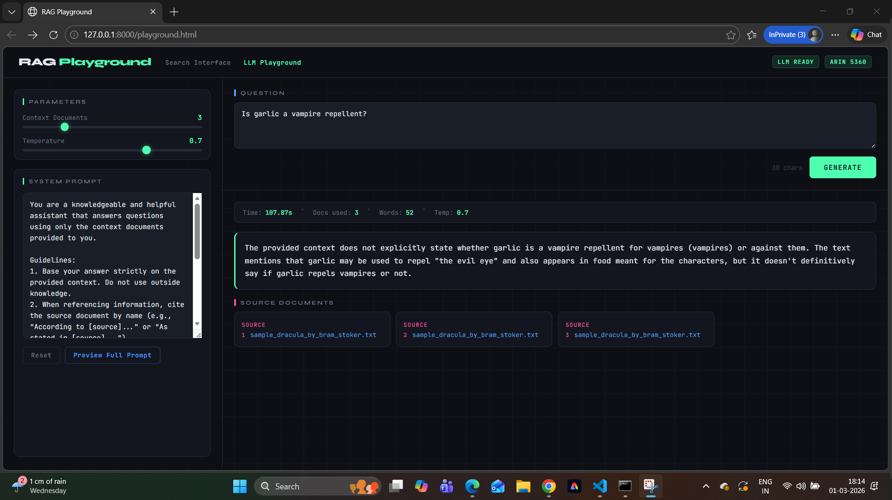
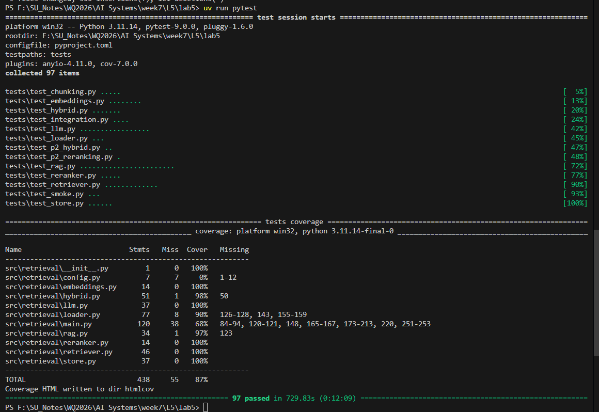

[](https://github.com/AartiDashore/lab5/actions/workflows/ci.yml)

# Lab 6: RAG System with Ollama
This lab extends the document retrieval system from Lab 5 into a full Retrieval-Augmented Generation (RAG) pipeline. It integrates a local LLM via Ollama to answer questions grounded in your indexed documents, and adds an interactive LLM Playground interface for prompt engineering.


Lab 5: CI/CD Pipeline & Web Interface

The lab extends the document retrieval system with an automated CI/CD pipeline as well.
Interactive Github actions are used to enforce code quality and reliability.
This is done by automated testing and linting.
The web interface provides a expanded front end for submitting queries and viewing and exporting retrieval results.

## Feature Progression

| Feature | Lab 3 | Lab 4 | P2 | Lab 5 | Lab 6 |
|---------|-------|-------|-----|-------|-----|
| **Text file support** | ✅ | ✅ | ✅ | ✅ | ✅ |
| **PDF support** | ❌ | ✅ | ✅ | ✅ | ✅ |
| **Document chunking** | ❌ | ✅ | ✅ | ✅ | ✅ |
| **Semantic search** | ✅ | ✅ | ✅ | ✅ | ✅ |
| **Cross-encoder reranking** | ❌ | ❌ | ✅ | ✅ | ✅ |
| **Hybrid search (RRF+BM25)** | ❌ | ❌ | ✅* | ✅* | ✅* |
| **CI/CD Pipeline** | ❌ | ❌ | ❌ | ✅ | ✅ |
| **RAG with LLM** | ❌ | ❌ | ❌ | ❌ | ✅ |
| **LLM Playground UI** | ❌ | ❌ | ❌ | ❌ | ✅ |


### New Features in Lab 6

- RAG Pipeline: Retrieves relevant documents and generates answers using a local LLM
- Ollama Integration: Runs LLMs locally via Ollama (no API key required)
- LLM Playground: Interactive UI for experimenting with prompts and RAG parameters
- /rag Endpoint: New FastAPI endpoint returning answers with source citations
- Health Check Update: /health now reports LLM availability via rag_available
- Mocked LLM Tests: CI-compatible tests using unittest.mock — no real LLM needed

### Features in Lab 5

- **CI/CD Pipeline**: GitHub Actions workflow automatically runs Ruff linting/format checks and pytest on each push and pull request
- **Web Interface**: Browser-based UI for submitting queries and viewing ranked retrieval results
- **Automated Quality Checks**: Ensures code style, formatting, and tests pass before integration
- **End-to-End Interaction**: Connects user input -> API -> retrieval pipeline -> displayed results

### New Features in P2 _(Extra Credit)_

- **BM25 Keyword Search**: Traditional keyword matching using BM25 algorithm
- **Reciprocal Rank Fusion**: Combines semantic and keyword results
- **Benefit**: Captures both semantic similarity and exact keyword matches

### New Features in P2 _(Required)_
 
- **Implementation**: Uses a cross-encoder model to rerank initial search results
- **Benefit**: Improves relevance by considering query-document interaction
- **Model**: `cross-encoder/ms-marco-MiniLM-L-6-v2`

### New Features in Lab 4

- **PDF Support**: Load and index PDF documents alongside text files
- **Document Chunking**: Automatically split large documents into overlapping chunks for better retrieval
- **Improved Metadata**: Track document type, chunk information, and source files

### Features in Lab 3

- **Semantic Search**: Use sentence transformers to encode documents and perform semantic search


## Setup

```bash
# Install dependencies
uv sync
```
### Ollama Setup

- Install Ollama: Download from https://ollama.com
- Pull a model (choose one based on your hardware):

```bash
   ollama pull qwen2.5:3b       # Recommended (default)
   ollama pull qwen2.5:0.5b     # Smaller, faster
   ollama pull llama3.2:1b      # Alternative
```

Verify Ollama is running:

```bash
   ollama list                  # See available models
   ollama run qwen2.5:3b "hello"  # Quick test
```

Ollama runs automatically in the background after installation. The default endpoint is http://localhost:11434.

# Example Queries:



# Code Coverage:


### Checking Out Assignment Code

Each assignment corresponds to a version tag:

| Assignment | Version | Git Tag               |
|------------|------------|-----------------------|
| Lab 3 | 1.0.0      | lab3_final _(sic)_    |
| Lab 4 | 2.0.0      | lab4-final            |
| Project 2 (required) | 3.0.0      | p2-required-final     |                 
| Project 2 (extra credit) | 3.1.0      | p2-extra-credit-final |

Use `git checkout <tag>` to access that assignment's code.

## Running the Server

```bash
uv run uvicorn src.retrieval.main:app --reload
```

Server starts at http://localhost:8000
Search Interface: http://localhost:8000/
LLM Playground: http://localhost:8000/playground.html
Health Check: http://localhost:8000/health
API Docs: http://localhost:8000/docs

## Usage

**Web Interface:** Visit http://localhost:8000

Search Interface — http://localhost:8000/
Basic semantic search from Lab 5 (unchanged).
LLM Playground — http://localhost:8000/playground.html
Interactive RAG interface with:

Context documents slider (1–10)
Temperature slider (0.0–1.0)
Editable system prompt with localStorage persistence
Full prompt preview modal
Answer display with citation highlighting
Expandable source document cards

**API:**
```bash
# Health check
curl http://localhost:8000/health

# Search
curl -X POST http://localhost:8000/search \
  -H "Content-Type: application/json" \
  -d '{"query": "machine learning", "n_results": 5}'
```

### Compare Approaches
```python
# Baseline: Semantic only
baseline = DocumentRetriever(use_reranking=False, use_hybrid=False)

# Required: With reranking (default)
with_rerank = DocumentRetriever(use_hybrid=False)

# Extra Credit: Full system by default
full_system = DocumentRetriever()

# Compare results for same query
query = "machine learning algorithms"
results_baseline = baseline.search(query)
results_rerank = with_rerank.search(query)
results_full = full_system.search(query)
```

## Testing

```bash
# Run all tests with coverage
uv run pytest

# Run with coverage report
uv run pytest --cov=src/retrieval --cov-report=html

# Smoke test only
uv run pytest tests/test_smoke.py

# Integration test demonstrating p2 feature effcetiveness
uv run pytest tests/test_p2_reranking.py -v -s
uv run pytest tests/test_p2_hybrid.py -v -s
```

## Code Quality

```bash
# Check formatting
uv run ruff format --check .

# Format code
uv run ruff format .

# Lint
uv run ruff check .
```
---

## Secrets Management with .env Files

For our project, we have 3 files that works together for managing the secrets:
- `.env` : This is our local configuration file that contains which port to run on, API keys, or which LLM model to use etc. It is never committed to Git as it contains sensitive information and only resides in our local machine at the root of the project.
- `.env.example` : This file is a template (also present at root) that is pushed to Git and contains placeholder or default values instead of real secrets to other developers that what variables are needed. When someone clones the repo, they run and fill their own values.
- `config.py` : It is a python file that reads the `.env` and make those values available to the code. It is present in the /src/retrieval folder.

```config.py:
from dotenv import load_dotenv
load_dotenv()  # reads the .env file
LLM_BASE_URL = os.getenv("LLM_BASE_URL", "http://localhost:11434")
```

To install dotenv dependency, run: `uv add python-dotenv`

The `load_dotenv()` call reads .env and loads it into environment variables. Then `os.getenv()` retrieves each value, with a fallback default if it is not set.

The `.gitignore` file makes sure that except .env file, rest other files gets pushed to Git.

```bash
.env
*.env
!.env.example
```

## Run CI Checks Locally

The CI pipeline runs the following checks. you can run them locally before pushing.

uv run ruff check .
uv run ruff format --check.
uv run pyest


## CI Pipeline

This project uses GitHub Actions for continuous integration.  
On each push and pull request, the workflow:

1. Installs dependencies  
2. Runs Ruff lint and formatting checks  
3. Runs the pytest test suite  

A passing workflow indicates all code quality and test checks succeeded.

---

## Project Structure

```
lab5/
│ 
├──.github/
│    └── worflows/
│        └──ci.yml # New
│ 
├── .env.example
│ 
├── src/retrieval/         # Source code
│   ├── __init__.py
│   ├── embeddings.py      # Document embedder
│   ├── loader.py          # Document loader
│   ├── store.py           # Vector store
│   ├── retriever.py       # Main retriever
│   ├── reranker.py        # Document reranker
│   ├── hybrid.py          # Hybrid searcher
│   ├── llm.py             # NEW: LLM client (Ollama/OpenAI)
│   ├── rag.py             # NEW: RAG pipeline
│   └── main.py            # FastAPI application (updated)
├── tests/                 # Test files
│   ├── test_reranker.py   
│   ├── test_hybrid.py     
│   ├── test_llm.py        # NEW: LLM client (Ollama/OpenAI)
│   ├── test_rag.py        # NEW: RAG pipeline
│   ├── test_p2_reranking.py
│   ├── test_p2_hybrid.py
│   ├── ...
│   └── data/              
├── static/
│   ├── index.html # ENHANCED
│   ├── search.js  # NEW
│   └── style.css  # ENHANCED
│               # Web interface
├── documents/             # Sample documents
└── pyproject.toml         # Project configuration
```

## Architecture

### RAG Pipeline
```
User Question
     ↓
1. Retrieve relevant docs  (DocumentRetriever.search())
     ↓
2. Build context string    (RAGSystem._build_context())
     ↓
3. Create prompt           (RAGSystem._create_prompt())
     ↓
4. Generate answer         (LLMClient.generate() → Ollama)
     ↓
Answer + Sources
```

### Core Components (from Labs 5)
- **Loader**: Handles .txt and .pdf files with intelligent chunking
- **Embedder**: Bi-encoder for initial semantic search (all-MiniLM-L6-v2)
- **Store**: ChromaDB for efficient vector search
- **LLMClient (llm.py)**: HTTP client supporting Ollama and OpenAI-compatible APIs
- **RAGSystem (rag.py)**: Orchestrates the full RAG pipeline
- **Playground (playground.html)**: Interactive prompt engineering UI


## Retrieval Pipeline

### Standard (With Reranking)
1. Semantic search retrieves top 20 candidates
2. Cross-encoder reranks candidates
3. Return top 5 most relevant

### With Hybrid Search (Extra Credit)
1. Semantic search retrieves top 20 candidates
2. BM25 search retrieves top 20 keyword matches
3. Reciprocal Rank Fusion combines both result sets
4. Cross-encoder reranks fused results
5. Return top 5 most relevant

## Key Implementation Details

### Why Rerank?
Bi-encoders (used in initial search) encode query and documents independently. Cross-encoders consider query-document interaction, giving more accurate relevance scores but at higher computational cost. We use bi-encoders for fast candidate retrieval, then cross-encoders for precise reranking.
#### References
* Cross-Encoders: [Reimers & Gurevych (2019) - Sentence-BERT](https://arxiv.org/abs/1908.10084)

### Why Hybrid?
Semantic search excels at understanding meaning but may miss exact keyword matches. BM25 captures keyword overlap but ignores semantics. RRF combines both approaches, leveraging their complementary strengths.

#### References
| Algorithm | Paper                                                                                                                                           |
|:----------|:------------------------------------------------------------------------------------------------------------------------------------------------|
| BM25 | [Robertson & Zaragoza (2009) - The Probabilistic Relevance Framework](https://www.staff.city.ac.uk/~sbrp622/papers/foundations_bm25_review.pdf) |
| RRF | [Cormack et al. (2009) - Reciprocal Rank Fusion](https://plg.uwaterloo.ca/~gvcormac/cormacksigir09-rrf.pdf)                                     |
### Chunking Strategy

Documents are automatically chunked if they exceed 500 characters:
- **Chunk Size**: 300 words per chunk
- **Overlap**: 30 words between consecutive chunks
- **Benefits**: Better retrieval of specific information in long documents

## Adding Documents

Place .txt files in the `documents/` directory and restart the server. Documents are indexed automatically on startup.

## Screenshot
The UI hasn't changed from Lab 4.
After placing the Dracula book in the documents/ directory, the server loads it as chunks.


